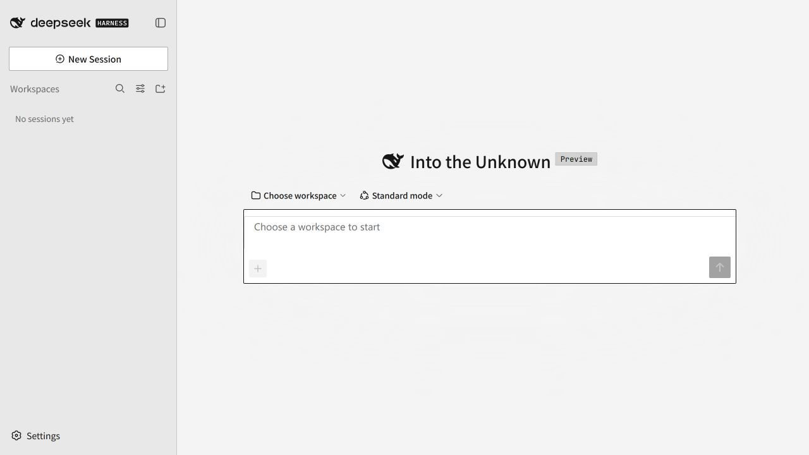
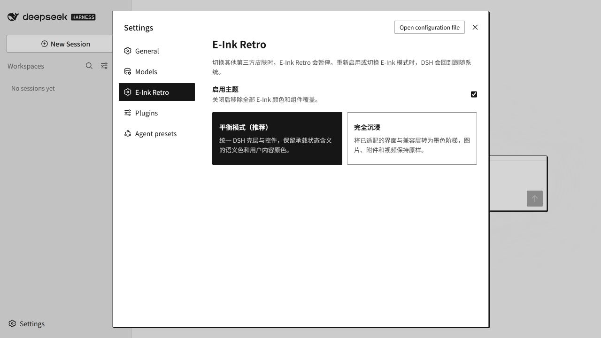

# DeepSeek Harness E-Ink Retro 主题

[English](README.md) | [简体中文](README.zh-CN.md)

[](https://dsh.market/?q=exoticknight%2Fdsh-theme-eink-retro)
[](https://github.com/exoticknight/dsh-theme-eink-retro/actions/workflows/ci.yml)
[](https://github.com/exoticknight/dsh-theme-eink-retro/releases/latest)
[](LICENSE)

E-Ink Retro 是面向 DeepSeek Harness 的客户端主题。它使用中性纸面、近黑文字、硬边偏移阴影、小圆角和黑白反选状态。几何借鉴经典 Macintosh 界面，同时保留 DSH 原有布局和工作流。



## 主要特点

- 平衡模式应用纸墨外壳，保留语义状态色和用户媒体。
- 沉浸模式将已支持的 DSH 表面和兼容层映射为单色墨阶。
- 链接、菜单、表单控件、树节点等已适配元素使用统一的键盘焦点样式。
- 图片、附件、视频、Canvas 输出和 iframe 内容保持原样。
- 主题设置跟随 DSH 页面语言，支持英语和简体中文，其他语言回退为英语。
- 选择其他第三方主题时，E-Ink Retro 会暂停。

## 模式

| 模式 | 行为 |
| --- | --- |
| **平衡** | 应用纸墨外壳和控件语言，保留语义状态色和用户内容。 |
| **沉浸** | 将已支持的 DSH 表面、状态 token 和兼容层映射为灰阶，用户媒体保持原样。 |
| **关闭** | 释放主题 token 层并移除根节点上的启用属性，插件保持安装。 |



## 安装

需要：

- 已安装 DeepSeek Harness，并可使用 `web` profile
- Node.js 20 或更高版本
- DSH 插件命令可以调用 `pnpm`

安装指定版本的 GitHub Release：

```sh
dsh plugin --profile web add github:exoticknight/dsh-theme-eink-retro#v0.3.1
```

安装后重启 DSH Web，然后打开 **设置 → E-Ink Retro**。

### 更新

安装较新的 Release tag，并替换命令中的版本号：

```sh
dsh plugin --profile web add github:exoticknight/dsh-theme-eink-retro#vX.Y.Z
```

切换版本后重启 DSH Web。命令有意固定 tag，升级行为明确且可以回退。

### 关闭或移除

在 **设置 → E-Ink Retro** 中清除 **启用主题**，即可停止应用主题而不移除插件。

从 profile 中移除包：

```sh
dsh plugin --profile web remove dsh-theme-eink-retro
```

移除后重启 DSH Web。插件卸载时会移除注入的样式和 token 层。浏览器会保留两个模式偏好，重新安装后可以恢复上次选择。

### 回退

重新安装指定版本：

```sh
dsh plugin --profile web add github:exoticknight/dsh-theme-eink-retro#v0.1.0
```

## 收录目录

你可以在以下目录找到 E-Ink Retro：

- [dsh.pub](https://dsh.pub/zh/plugins/dsh-theme-eink-retro/)
- [DSH Market](https://dsh.market/?q=exoticknight%2Fdsh-theme-eink-retro)
- [DSH Marketplace](https://dshmarketplace.dev/zh/plugins?q=dsh-theme-eink-retro)
- [HackSing DSH 插件目录](https://github.com/HackSing/dsh-plugins/blob/main/README.zh.md)
- [Awesome DSH Plugin 目录](https://github.com/awesome-dsh-plugin/awesome-dsh-plugin/blob/main/data/plugins/exoticknight__dsh-theme-eink-retro.yml)
- [Awesome DSH Plugins](https://github.com/AdamPlatin123/awesome-dsh-plugins/blob/main/PLUGINS.md)
- [Awesome DeepSeek Harness](https://github.com/0xsline/awesome-deepseek-harness/blob/main/CATALOG.md)
- [dsh-xray 能力卡](https://unstone.github.io/dsh-xray/p/exoticknight__dsh-theme-eink-retro.html)

## 使用

打开 **设置 → E-Ink Retro**，启用主题，然后选择平衡或沉浸模式。

选择其他第三方主题时，E-Ink Retro 会暂停。在第三方主题启用期间重新启用 E-Ink Retro 或切换它的模式，DSH 会回到跟随系统。切回 DSH 内置的跟随系统、浅色或深色主题后，E-Ink Retro 会恢复所选模式。

## 兼容性

`v0.3.1` 在以下环境完成构建和检查：

| 组件 | 版本或环境 |
| --- | --- |
| DeepSeek Harness | `0.1.5-rc.2` |
| Node.js | `24.2.0` |
| pnpm | `11.24.0` |
| 操作系统 | Windows `10.0.26200.0` |

DSH 仍处于开发者预览阶段。后续版本可能调整界面钩子或主题 token，届时插件需要同步更新。

### 兼容边界

主题通过 DSH 语义 token 和经过验证的组件表面工作。使用这些 token 的组件会继承主题色板。

- 原生下拉菜单展开后可能使用操作系统样式。
- 使用硬编码颜色、Shadow DOM 或独立渲染层的插件只能继承部分主题。
- 可选的 `dsh-context` 适配以 `v0.31.x` 接口为目标。
- 高对比度模式和打印媒体有明确的回退处理。本项目不声明已完成完整 WCAG 认证。

## 隐私与存储

E-Ink Retro 在 DSH 客户端运行，host 入口不执行主题功能。

- 插件使用 DSH 的 runtime、theme 和 settings 服务。
- 插件修改 DOM 属性、CSS 和主题 token。
- 插件在浏览器 `localStorage` 中保存两个模式偏好。
- 当前源码没有网络请求、遥测、对话读取或文件访问。
- 移除插件不会删除两个模式偏好。

## 支持

请通过 [GitHub Issues](https://github.com/exoticknight/dsh-theme-eink-retro/issues) 报告问题。请附上 DSH 版本、插件版本、E-Ink 模式、DSH 内置主题、截图和复现步骤。

## 从源码安装

克隆仓库，安装依赖并构建：

```sh
npm install
npm run build
```

把源码目录链接到 DSH：

```sh
dsh plugin --profile web add link:/absolute/path/to/dsh-theme-eink-retro
```

Windows 示例：

```powershell
dsh plugin --profile web add link:C:/path/to/dsh-theme-eink-retro
```

## 开发与维护

提交修改前运行完整检查：

```sh
npm run check
git diff --exit-code -- lib
npm pack --dry-run
```

主要实现文件：

- `src/client/tokens.ts`：平衡模式 token 和沉浸模式墨阶覆盖层
- `src/theme.css`：设计 token、组件几何、交互状态和兼容适配
- `src/client/index.ts`：模式存储、token 安装、DSH 主题协调、设置和清理
- `tests/theme.test.mjs`：包、发布和主题边界回归测试

约定：

- 主题 CSS 应限制在 `html[data-dsh-theme-eink-retro]` 下。插件设置区块需要在主题关闭时保持可读，因此使用 `.eink-retro-settings` 命名空间。
- 作者定义的颜色应放在 `--eink-*` token 后。组件可以直接使用代表其 DSH 表面角色的官方 `--dsw-*` 语义 token。
- `--eink-rule` 用于分隔线和静态表面，`--eink-rule-strong` 用于可操作或浮起的表面。
- 单色兼容适配应限制在 `immersive` 属性选择器下。
- 不要添加全局媒体滤镜。使用构建生成的 class 选择器时，必须用注释说明目标为何没有稳定钩子。
- 匹配本地化 accessible name 的选择器必须使用子串匹配，列出全部支持语言，并带有结构约束。

## 许可证

[Apache License 2.0](LICENSE)
